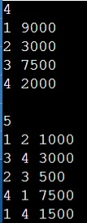
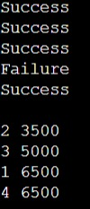

# DIGITAL Bank Transaction Simulation

## Introduction
This C++ program simulates a simple banking system where users can transfer amounts between each other. Each user has a unique identifier (`uid`) and an associated balance (`amt`). The program handles multiple transactions, updating user balances accordingly, and sorts the users based on their final balances.

## Description
The program reads input data for a set of users, including their unique IDs and initial balances. It then processes a series of transactions where money is transferred from one user to another. After processing all transactions, the program sorts the users by their balances in ascending order and outputs the final state.

### Key Components:
1. **Input Handling**:
   - The number of users (`n`) is input first.
   - Each user’s ID (`uid`) and balance (`amt`) are recorded in two separate vectors.
   - The number of transactions (`t`) is input, followed by each transaction's details.

2. **Transaction Processing**:
   - For each transaction, the program identifies the user IDs involved and checks if the transaction is possible (i.e., the sender has enough balance).
   - If the transaction is successful, the balances are updated, and "Success" is printed; otherwise, "Failure" is printed.

3. **Sorting**:
   - After processing all transactions, the users are sorted based on their balances in ascending order.

## Explanation
The program is designed to handle a simple banking transaction scenario:

- **Data Structure**: Two vectors are used to store user IDs and their corresponding balances.
- **Sorting**: A custom sorting function is implemented to sort the users based on their balances. This is done using a basic selection sort algorithm, where users are swapped based on their balance amounts.
- **Transaction Logic**: The program identifies users by their unique IDs, finds their positions in the vectors, and then performs the transfer if the conditions are met.

## Conclusion
This program effectively demonstrates how to simulate bank transactions between users, update balances, and sort data based on specific criteria. It can be expanded or modified to include additional features such as handling edge cases, more complex sorting, or different transaction types.

## OUTPUT

